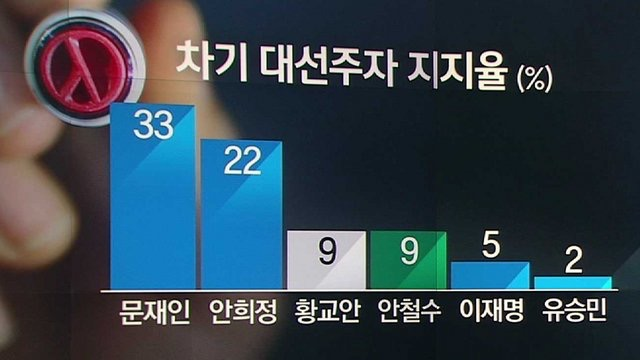

## Problem

JTBC 뉴스룸에서는 다음과 같은 도표의 후보지지도 여론조사 결과를 보도. 



막대의 높이에 의구심을 표한 시청자들의 항의에 직면함. 

제대로 된 막대그래프를 그리면서 R Base plot과 ggplot에 대하여 학습.


## Data Setup

```{r, data}
candidates <- c("문재인", "안희정", "황교안", "안철수", "이재명", "유승민") 
rates <- c(33, 22, 9, 9, 5, 2)
party <- c("더불어민주당", "자유한국당", "국민의당", "바른정당")
colour_party <- c("skyblue", "lightgrey", "darkgreen", "darkblue")
candidates_party <-  c("더불어민주당", "더불어민주당", "자유한국당", "국민의당", "더불어민주당", "바른정당")
match(candidates_party, party)
candidates_colour <- colour_party[match(candidates_party, party)]
```

<P style = "page-break-before:always">

## Barplot (R Base)

```{r, fig.width = 8, fig.height = 4}
barplot(rates)
```

<P style = "page-break-before:always">

```{r, fig.width = 8, fig.height = 4}
par(family = "KoPubWorldDotum Medium")
b1 <- barplot(rates, 
              axes = FALSE, 
              col = candidates_colour, 
              names.arg = candidates,
              cex.names = 1.2)
text(x = b1, y = rates + c(rep(-3, 4), rep(1.5, 2)), 
     labels = rates, 
     cex = 1.2)
main_title <- "차기 대선주자 지지율(%)"
title(main = main_title, 
      cex.main = 2)
box(which = "figure", lwd = 3)
dev.copy(png, "../pics/jtbc1702.png", width = 640, height = 320)
dev.off()
```

<P style = "page-break-before:always">

## ggplot

```{r, ggplot, fig.width = 8, fig.height = 4}
library(ggplot2)
candidates_f <- factor(candidates, 
                       levels = candidates)
rates_df <- data.frame(후보 = candidates_f, 
                       정당 = candidates_party, 
                       색깔 = candidates_colour,
                       지지도 = rates)
g0 <- ggplot(data = rates_df, 
             mapping = aes(x = 후보, 
                           y = 지지도))
(g1 <- g0 +
  geom_bar(stat = "identity"))
```

<P style = "page-break-before:always">

```{r, fig.height = 4, fig.width = 8}
(g1 <- g0 +
  geom_bar(stat = "identity", 
           fill = candidates_colour))
(g2 <- g1 +
  theme_bw(base_family = "KoPubWorldDotum Medium"))
(g3 <- g2 +
  geom_text(mapping = aes(x = 후보, 
                          y = 지지도 + c(rep(-3, 4), rep(2, 2)), 
                          label = 지지도), 
                          size = 6))
(g4 <- g3 +
  labs(title = main_title))
```

<P style = "page-break-before:always">

```{r, fig.height = 4, fig.width = 8}
(g5 <- g4 +
  theme(plot.title = element_text(hjust = 0.5)))
(g6 <- g5 +
  scale_y_continuous(breaks = rates, labels = rates))
```

<P style = "page-break-before:always">

```{r, fig.height = 4, fig.width = 8}
(g7 <- g6 +
  theme(panel.border = element_blank(),
        axis.title.x = element_blank(),
        axis.title.y = element_blank(),
        axis.text.x = element_text(vjust = 0),
        axis.ticks = element_blank(), 
        axis.text.y = element_blank()))
```

<P style = "page-break-before:always">

```{r, fig.height = 4, fig.width = 8}
(g8 <- g7 +
    ggtitle("") +
    annotate("text", 
             x = mean(b1), 
             y = Inf, 
             label = main_title, 
             vjust = 1.5, 
             size = 6,
             family = "KoPubWorldDotum Bold"))
```
